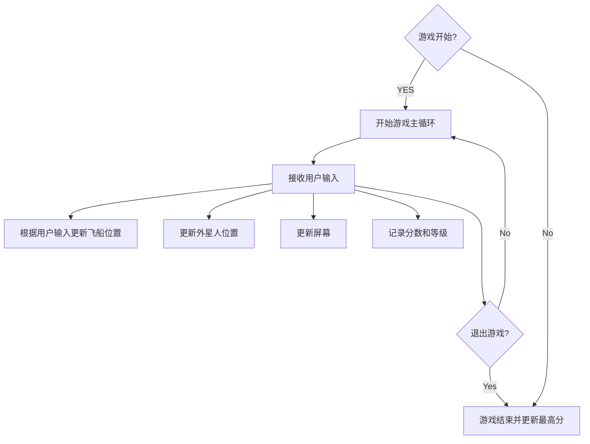
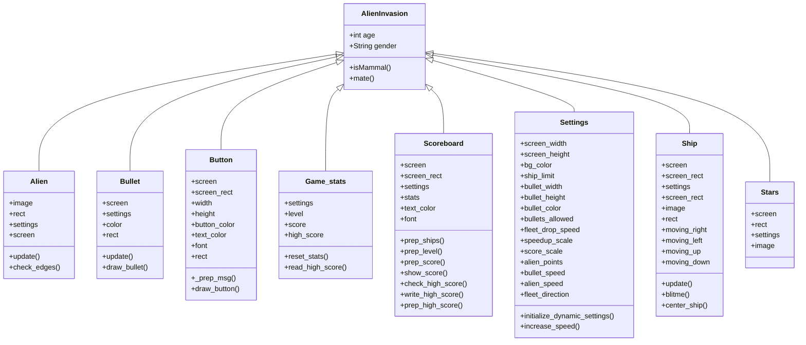

# 《Python程序设计基础》程序设计作品说明书

题目： 外星人入侵游戏

学院： 21计科

姓名： 姚义香

学号： B20210302310

指导教师： 周景

起止日期：2023.11.10-2023.12.10

## 摘要

_本游戏项目基于Python编程语言，旨在创建一款简单而有趣的2D射击游戏，玩家将扮演宇航员，面对突如其来的外星人入侵，通过射击和躲避来保卫地球。游戏将生成不同类型的外星人，它们以不同的速度和路径向玩家发起进攻。玩家通过键盘或鼠标控制宇航员的移动，实现上、下、左、右的方向控制。玩家也可通过按键或点击屏幕进行射击，尝试消灭逼近的外星人，并记录分数，将最高分保存到文件。随着时间的推移，外星人的速度将逐渐增加，提高游戏难度。_

关键词：Python，游戏，外星人，射击游戏

## 第1章 需求分析

_本章的内容主要包括系统的需求分析，系统主要需要实现的功能有哪些，可以帮助用户解决哪些问题等等。_

### 1.1系统功能

· 玩家控制：提供键盘或鼠标控制飞船移动，实现上、下、左、右方向控制。  
· 外星人移动：生成多个外星人，它们以不同的速度和路径向玩家发起进攻。  
· 射击：通过按键或点击屏幕进行射击，尝试消灭逼近的外星人，并记录分数，将最高分保存到文件。  
· 游戏难度：随着游戏进程的增加，外星人的速度将逐渐增加，提高游戏难度。  

### 1.2 用户问题解决方案

· 提供娱乐性和挑战性兼备的游戏体验，适合格各类玩家。  
· 游戏简单易上手，玩家可以轻松上手，不需任何操作经验。  
· 通过游戏让玩家体验外星人入侵的紧张刺激感。  
· 计分系统的引入可以帮助玩家评估自己在游戏中的表现，通过记录分数，玩家可以了解自己的游戏水平和进步情况，激发竞争欲望。  

## 第2章 分析与设计

_本章的内容主要包括系统的设计，例如：系统架构、系统流程、系统模块、数据库的设计，以及关键的实现，例如：使用的数据结果、算法。_

### 2.1 系统架构

### 2.2 系统流程

### 2.3 系统模块

### 2.4 数据库设计

### 2.5 关键实现

## 第3章 软件测试

_本章的内容主要包括以类和函数作为单元进行单元测试，编写的对系统的主要功能的测试用例，以及测试用例执行的测试报告。_

## 结论

_本章的内容主要是对项目的总结，项目主要实现了哪些功能，达到了哪些目标，哪些不足之处，可以如何改进。_

## 参考文献
