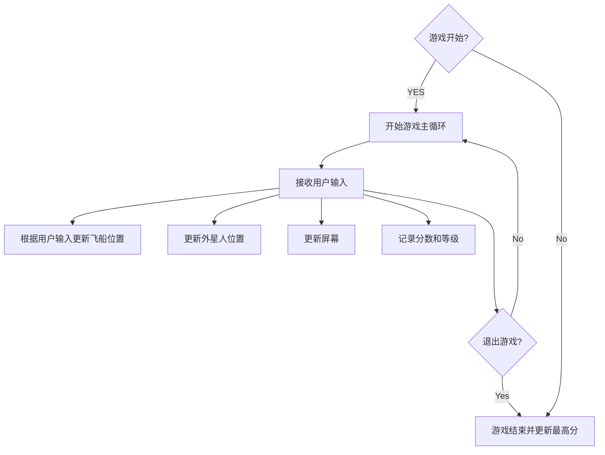
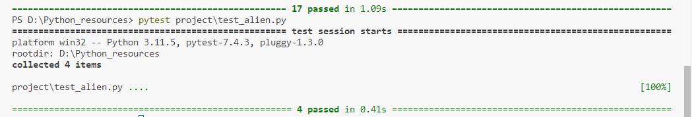
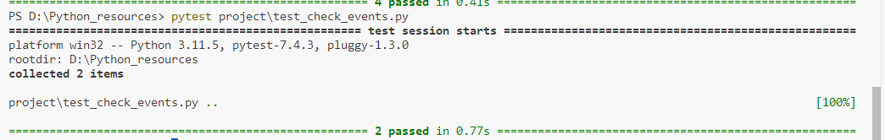

# 《Python程序设计基础》程序设计作品说明书

题目： 外星人入侵游戏

学院： 21计科

姓名： 姚义香

学号： B20210302310

指导教师： 周景

起止日期：2023.11.10-2023.12.10

## 摘要

_本游戏项目基于Python编程语言，旨在创建一款简单而有趣的2D射击游戏，玩家将扮演宇航员，面对突如其来的外星人入侵，通过射击和躲避来保卫地球。游戏将生成不同类型的外星人，它们以不同的速度和路径向玩家发起进攻。玩家通过键盘或鼠标控制宇航员的移动，实现上、下、左、右的方向控制。玩家也可通过按键或点击屏幕进行射击，尝试消灭逼近的外星人，并记录分数，将最高分保存到文件。随着时间的推移，外星人的速度将逐渐增加，提高游戏难度。_

关键词：Python，游戏，外星人，射击游戏

## 第1章 需求分析

_本章的内容主要包括系统的需求分析，系统主要需要实现的功能有哪些，可以帮助用户解决哪些问题等等。_

### 1.1系统功能

· 玩家控制：提供键盘或鼠标控制飞船移动，实现上、下、左、右方向控制。  
· 外星人移动：生成多个外星人，它们以不同的速度和路径向玩家发起进攻。  
· 射击：通过按键或点击屏幕进行射击，尝试消灭逼近的外星人，并记录分数，将最高分保存到文件。  
· 游戏难度：随着游戏进程的增加，外星人的速度将逐渐增加，提高游戏难度。  

### 1.2 用户问题解决方案

· 提供娱乐性和挑战性兼备的游戏体验，适合格各类玩家。  
· 游戏简单易上手，玩家可以轻松上手，不需任何操作经验。  
· 通过游戏让玩家体验外星人入侵的紧张刺激感。  
· 计分系统的引入可以帮助玩家评估自己在游戏中的表现，通过记录分数，玩家可以了解自己的游戏水平和进步情况，激发竞争欲望。  

## 第2章 分析与设计

_本章的内容主要包括系统的设计，例如：系统架构、系统流程、系统模块、数据库的设计，以及关键的实现，例如：使用的数据结果、算法。_

### 2.1 系统架构

_本游戏采用经典的游戏开发架构，分为三大部分：用户界面（GUI）、游戏逻辑和数据存储。_

#### 2.1.1 用户界面(GUI)

_用户界面(GUI)是用户与计算机交互的接口，是游戏程序的图形显示界面。本项目中的用户界面包括游戏窗口、分数显示、外星人和飞船的图形表示等。通过Pygame等库实现，确保良好的用户交互体验。_

#### 2.1.2 游戏逻辑

_游戏逻辑处理是游戏程序的核心，包括玩家控制、外星人移动、射击和游戏难度等。通过Pygame等库实现，确保良好的游戏逻辑。主要包括以下几块：_

##### · 游戏引擎模块：

 控制游戏的基本逻辑，处理外星人生成、玩家控制、射击等核心功能。

##### · 计分模块：

负责处理玩家得分逻辑，将最高分保存到文件。

##### · 难度调整模块：

根据游戏进程调整外星人的速度和数量，增加游戏难度。

#### 2.1.3 数据存储

_数据存储模块负责处理游戏数据，包括玩家得分、外星人位置、飞船位置等。通过Pygame等库实现，确保良好的数据存储。_

### 2.2 系统流程



### 2.3 系统模块


### 2.4 数据库设计

由于本游戏的数据规模相对较小且主要包含玩家的最高分信息，因此选择使用简单的文本文件而非传统的数据库来存储数据。

#### 2.4.1 数据存储结构

为了保存最高分信息，将采用简单的json文件格式。文件的第一行就是目前的最高分。

#### 2.4.2 数据访问方式

通过Python的文件读写操作实现对json文件的访问。使用适当的文件读写方法来更新和检索最高分信息。

#### 2.4.3 数据库操作

1. 读取最高分： 游戏启动时，系统读取json文件以获取当前的最高分信息。

2. 更新最高分： 当玩家在游戏中获得新的最高分时，系统将更新json文件中对应的玩家分数

### 2.5 关键实现


## 第3章 软件测试

_本章的内容主要包括以类和函数作为单元进行单元测试，编写的对系统的主要功能的测试用例，以及测试用例执行的测试报告。_

### 3.1 测试Alien类

(1) 测试用例

```python
import pytest
import pygame
from alien import Alien
class MockAIGame:
    """ Mocking the ai_game object that is expected to be passed to Alien"""
    def __init__(self, screen, settings):
        """初始化"""
        self.screen = screen
        self.settings = settings
class MockSettings:
    """ Mocking the settings object that is expected to be passed to Alien"""
    def __init__(self, alien_speed, fleet_direction):
        """初始化"""
        self.alien_speed = alien_speed
        self.fleet_direction = fleet_direction
@pytest.fixture
def ai_game():
    """ 返回一个mock的ai_game对象"""
    screen = pygame.display.set_mode((800, 600))
    settings = MockSettings(alien_speed=1.0, fleet_direction=1)
    return MockAIGame(screen, settings)
@pytest.mark.parametrize("alien_speed, fleet_direction, expected_x", [
    # ID: HappyPath-MovingRight
    (1.0, 1, 31.0),
    # ID: HappyPath-MovingLeft
    (1.0, -1, 29.0),
])
def test_alien_update(ai_game, alien_speed, fleet_direction, expected_x):
    """测试Alien类的update"""
    # Arrange
    ai_game.settings.alien_speed = alien_speed
    ai_game.settings.fleet_direction = fleet_direction
    alien = Alien(ai_game)
    alien.x = 30.0  # Starting from 30 for testing
    alien.update()
    assert alien.x == expected_x
    assert alien.rect.x == int(expected_x)
@pytest.mark.parametrize("alien_position, fleet_direction, expected", [
    # ID: HappyPath-NotAtEdge
    ((100, 100), 1, False),
    # ID: EdgeCase-AtRightEdge
    ((770, 100), 1, True),
])
def test_alien_check_edges(ai_game, alien_position, fleet_direction, expected):
    """测试Alien类的_check_edges"""
    ai_game.settings.fleet_direction = fleet_direction
    alien = Alien(ai_game)
    alien.rect.x, alien.rect.y = alien_position
    at_edge = alien.check_edges()
    assert at_edge == expected
```

(2) 测试报告


### 3.2 测试按键按下

(1) 测试用例

```python
from alien_invasion import AlienInvasion
import pygame 
import pytest
import sys

def test_keydown_event_moving_right():
    """测试按键按下向右键事件的处理"""
    ai_game=AlienInvasion()
    event=pygame.event.Event(pygame.KEYDOWN,key=pygame.K_RIGHT)
    ai_game._check_keydown_events(event)
    
    #在这里添加断言来检查按键事件的处理逻辑是否符合预期
    assert ai_game.ship.moving_right is True
    
def test_keydown_event_moving_left():
    """测试按键按下向左键事件的处理"""
    ai_game=AlienInvasion()
    event=pygame.event.Event(pygame.KEYDOWN,key=pygame.K_LEFT)
    ai_game._check_keydown_events(event)
    
    #在这里添加断言来检查按键事件的处理逻辑是否符合预期
    assert ai_game.ship.moving_left is True

```

(2) 测试报告



### 3.3 测试按键松开

(1) 测试用例

```python
from alien_invasion import AlienInvasion
import pygame 
import pytest
import sys

def test_keyup_event_moving_right():
    """测试按键松开向右键事件的处理"""
    ai_game=AlienInvasion()
    event=pygame.event.Event(pygame.KEYUP,key=pygame.K_RIGHT)
    ai_game._check_keyup_events(event)
    
    #在这里添加断言来检查按键事件的处理逻辑是否符合预期
    assert ai_game.ship.moving_right is False
    
def test_keyup_event_moving_left():
    """测试按键松开向左键事件的处理"""
    ai_game=AlienInvasion()
    event=pygame.event.Event(pygame.KEYUP,key=pygame.K_LEFT)
    ai_game._check_keyup_events(event)
    
    #在这里添加断言来检查按键事件的处理逻辑是否符合预期
    assert ai_game.ship.moving_left is False
```

(2) 测试报告


## 结论

本项目成功地实现了一个基于Python的外星人入侵游戏，提供了一系列有趣的游戏玩法和挑战。玩家通过键盘或鼠标控制宇航员的移动，实现上、下、左、右的方向控制，以及通过按键或点击屏幕进行射击。同时，实现了计分模块，记录玩家的得分，并将最高分保存到文件。并且随着时间的推移，外星人的速度逐渐增加，提高游戏难度，为玩家提供更大的挑战。与此同时，还实现了随机生成随机个数的星星散落到屏幕中。但是，这个项目还有存在着一些不足之处，例如，缺少音效和动画元素，这可能影响游戏的沉浸感；图形和界面相对简单。改进方法：使用图形库（如Pygame、PyQt等）升级游戏的图形和界面，提升视觉效果。添加音效和动画元素，增强游戏的沉浸感。进行更全面的测试，包括性能测试，以确保游戏在不同环境下都能稳定运行。

## 参考文献
