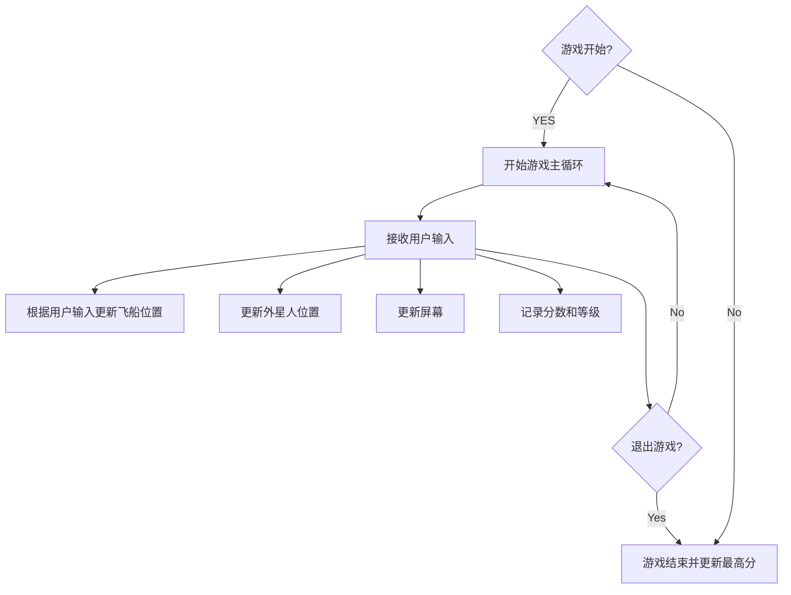
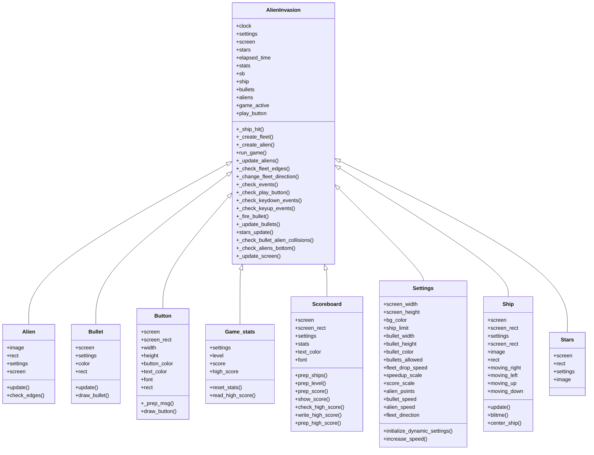

# 《Python程序设计基础》程序设计作品说明书

题目： 外星人入侵游戏

学院： 21计科

姓名： 姚义香

学号： B20210302310

指导教师： 周景

起止日期：2023.11.10-2023.12.10

## 摘要

_本游戏项目基于Python编程语言，旨在创建一款简单而有趣的2D射击游戏，玩家将扮演宇航员，面对突如其来的外星人入侵，通过射击和躲避来保卫地球。游戏将生成不同类型的外星人，它们以不同的速度和路径向玩家发起进攻。玩家通过键盘或鼠标控制宇航员的移动，实现上、下、左、右的方向控制。玩家也可通过按键或点击屏幕进行射击，尝试消灭逼近的外星人，并记录分数，将最高分保存到文件。随着时间的推移，外星人的速度将逐渐增加，提高游戏难度。与此同时，屏幕上会在随机位置出现随机个数的星星。_

关键词：Python，游戏，外星人，射击游戏

## 第1章 需求分析

### 1.1系统功能

· 玩家控制：提供键盘或鼠标控制飞船移动，实现上、下、左、右方向控制。  
· 外星人移动：生成多个外星人，它们以不同的速度和路径向玩家发起进攻。  
· 射击：通过按键或点击屏幕进行射击，尝试消灭逼近的外星人，并记录分数，将最高分保存到文件。  
· 游戏难度：随着游戏进程的增加，外星人的速度将逐渐增加，提高游戏难度。  

### 1.2 用户问题解决方案

· 提供娱乐性和挑战性兼备的游戏体验，适合格各类玩家。  
· 游戏简单易上手，玩家可以轻松上手，不需任何操作经验。  
· 通过游戏让玩家体验外星人入侵的紧张刺激感。  
· 计分系统的引入可以帮助玩家评估自己在游戏中的表现，通过记录分数，玩家可以了解自己的游戏水平和进步情况，激发竞争欲望。  

## 第2章 分析与设计

### 2.1 系统架构

_本游戏采用经典的游戏开发架构，分为三大部分：用户界面（GUI）、游戏逻辑和数据存储。_

1. 用户界面(GUI)
_用户界面(GUI)是用户与计算机交互的接口，是游戏程序的图形显示界面。本项目中的用户界面包括游戏窗口、分数显示、外星人和飞船的图形表示等。通过Pygame等库实现，确保良好的用户交互体验。_
2. 游戏逻辑
_游戏逻辑处理是游戏程序的核心，包括玩家控制、外星人移动、射击和游戏难度等。通过Pygame等库实现，确保良好的游戏逻辑。主要包括以下几块：_
(1) 游戏引擎模块：
 控制游戏的基本逻辑，处理外星人生成、玩家控制、射击等核心功能。
(2) 计分模块：
负责处理玩家得分逻辑，将最高分保存到文件。
(3) 难度调整模块：
根据游戏进程调整外星人的速度和数量，增加游戏难度。
3. 数据存储
_数据存储模块负责处理游戏数据，包括玩家得分、外星人位置、飞船位置等。通过Pygame等库实现，确保良好的数据存储。_

### 2.2 系统流程



### 2.3 系统模块



### 2.4 数据库设计

由于本游戏的数据规模相对较小且主要包含玩家的最高分信息，因此选择使用简单的文本文件而非传统的数据库来存储数据。

1. 数据存储结构
为了保存最高分信息，将采用简单的json文件格式。文件的第一行就是目前的最高分。
2. 数据访问方式
通过Python的文件读写操作实现对json文件的访问。使用适当的文件读写方法来更新和检索最高分信息。
3. 数据库操作
(1) 读取最高分： 游戏启动时，系统读取json文件以获取当前的最高分信息。
(2) 更新最高分： 当玩家在游戏中获得新的最高分时，系统将更新json文件中对应的玩家分数

### 2.5 关键实现

（1）数据持久化
Python的json模块提供了对json文件的基本操作，包括读取、写入、更新和检索。为了保留玩家的最高分记录，需要实现数据持久化。将最高分保存到json文件中，以便后续读取和更新最高分。关键代码如下：
```python
    def check_high_score(self):
        """检查是否诞生了新的最高分"""
        if self.stats.score>self.stats.high_score:
            self.stats.high_score=self.stats.score
            self.prep_high_score()
    def write_high_score(self):
        """将最高分写入文件"""
        filename='hightest_score.json'
        with open(filename,'w') as file:
            json.dump(self.stats.high_score,file)
```
（2）用户输入与控制
通过键盘和鼠标实现宇航员的移动和射击，为玩家提供直观的游戏操控体验。确保对用户输入的实时响应，以及相应事件的正确处理。关键代码如下：
```python
    def _check_keydown_events(self,event):
        """响应按下"""
        if event.key==pygame.K_RIGHT:#玩家按下向右键时moving_right为True
            #向右移动飞船
            self.ship.moving_right=True
        elif event.key==pygame.K_LEFT:
            #向左移动
            self.ship.moving_left=True
        elif event.key==pygame.K_q:#按Q键退出
            self.sb.write_high_score()
            sys.exit()
        elif event.key==pygame.K_SPACE:#按空格键发射一颗子弹
            self._fire_bullet()
        elif event.key==pygame.K_UP:
            self.ship.moving_up=True
        elif event.key==pygame.K_DOWN:
            self.ship.moving_down=True
    def _check_keyup_events(self,event):
        """响应释放"""
        if event.key==pygame.K_RIGHT:#玩家释放向右键时moving_right为False
            self.ship.moving_right=False
        elif event.key==pygame.K_LEFT:
            self.ship.moving_left=False
        elif event.key==pygame.K_UP:
            self.ship.moving_up=False
        elif event.key==pygame.K_DOWN:
            self.ship.moving_down=False
            
```
（3）碰撞检测算法
在外星人入侵游戏中，碰撞检测算法是确保游戏元素交互正确的关键部分。当宇航员的位置与外星人的位置重叠时，触发碰撞检测；当子弹的位置与外星人的位置重叠时，触发碰撞检测；防止游戏元素越界，即超出游戏界面的边界。关键代码如下：
```python
    def _check_bullet_alien_collisions(self):
        """响应子弹和外星人的碰撞"""
        #删除发生碰撞的子弹和外星人
        #检查是否有子弹击中了外星人
        #如果是，就删除相应的子弹和外星人
        collisions=pygame.sprite.groupcollide(self.bullets,self.aliens,True,True)
        if collisions:
            for aliens in collisions.values():
                self.stats.score += self.settings.alien_points*len(aliens)
            self.sb.prep_score()
            self.sb.check_high_score()
        if not self.aliens:
            #删除现有的子弹并创建一个新的外星舰队
            self.bullets.empty()
            self._create_fleet()
            self.settings.increase_speed()
            
            #提高等级，整个外星舰队都被击落，就提高一个等级
            self.stats.level += 1
            self.sb.prep_level()
    def _check_aliens_bottom(self):
        """检查是否有外星人到达了屏幕的下边缘"""
        for alien in self.aliens.sprites():
            if alien.rect.bottom >=self.settings.screen_height:
                #像飞船被撞到一样进行处理
                self._ship_hit()
                break
```

## 第3章 软件测试

|\#| 测试目标| 输入 | 预期结果 | 测试结果 |
| --- | --------- | ----- | ---------------- | ----------------- |
| 1 |测试AlienInvasion类的check_keydown_events方法——按下向右键|ai_game 为 AlienInvasion 实例，模拟 KEYDOWN 事件，按下右箭头键|ai_game.ship.moving_right 属性为 True |通过|
| 2 |测试AlienInvasion类的check_keydown_events方法——按下向左键|ai_game 为 AlienInvasion 实例，模拟 KEYDOWN 事件，按下左箭头键|ai_game.ship.moving_left 属性为 True|通过|
| 3 |测试AlienInvasion类的check_keyup_events方法——松开向右键|ai_game 为 AlienInvasion 实例，模拟 KEYUP 事件，松开右箭头键|ai_game.ship.moving_right属性为False|通过|
| 4 |测试AlienInvasion类的check_keyup_events方法——松开向左键|ai_game 为 AlienInvasion 实例，模拟 KEYUP 事件，松开左箭头键|ai_game.ship.moving_left 属性为 False|通过|
| 5 |测试button类——测试按键的创建|msg="Play", expected=(0, 135, 0)|Button 对象被正确创建，msg_image 不为 None，按钮属性正确设置|通过|
| 6 |测试button类——测试按键的可视化|msg="Play", color=(255, 0, 0), font_size=48|按钮的颜色、字体大小被正确设置|通过|
| 7|测试settings类——测试increase_speed方法|speedup_scale=0.5, score_scale=0.5|expected_ship_speed=0.75，expected_bullet_speed=1.25，expected_alien_speed=0.5，expected_alien_points=25|通过|
| 8 |测试settings类——测试 initialize_dynamic_settings 方法|无|将速度和方向属性重置到默认值|通过|

## 结论

本项目成功地实现了一个基于Python的外星人入侵游戏，提供了一系列有趣的游戏玩法和挑战。玩家通过键盘或鼠标控制宇航员的移动，实现上、下、左、右的方向控制，以及通过按键或点击屏幕进行射击。同时，实现了计分模块，记录玩家的得分，并将最高分保存到文件。并且随着时间的推移，外星人的速度逐渐增加，提高游戏难度，为玩家提供更大的挑战。与此同时，还实现了随机生成随机个数的星星散落到屏幕中。但是，这个项目还有存在着一些不足之处，例如，缺少音效和动画元素，这可能影响游戏的沉浸感；图形和界面相对简单。改进方法：使用图形库（如Pygame、PyQt等）升级游戏的图形和界面，提升视觉效果。添加音效和动画元素，增强游戏的沉浸感。进行更全面的测试，包括性能测试，以确保游戏在不同环境下都能稳定运行。

## 参考文献

[1]《Python教程：从入门到实践（第三版）》
[2]《Python游戏编程入门：零基础玩转Python游戏开发》
[3]《Python 游戏编程入门》
