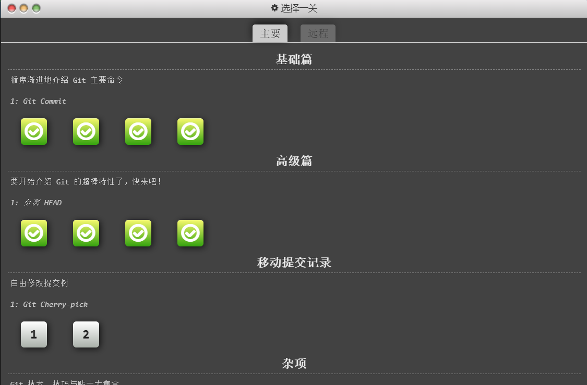
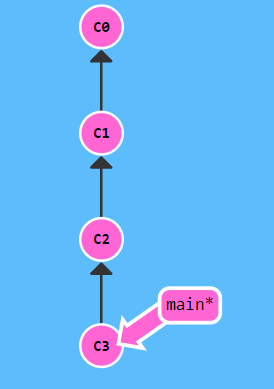
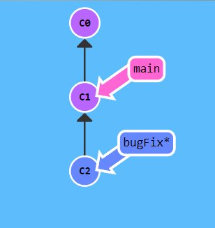
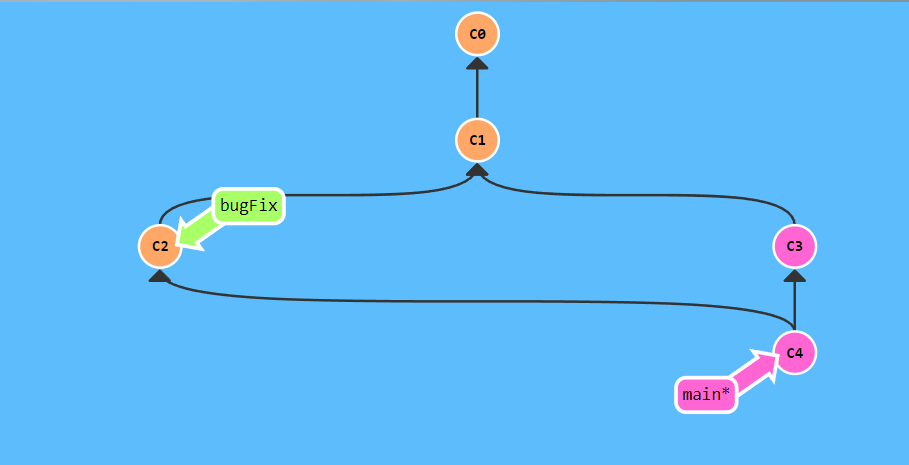
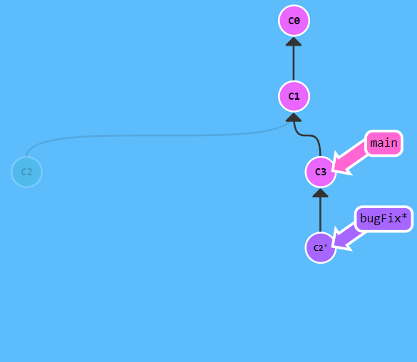
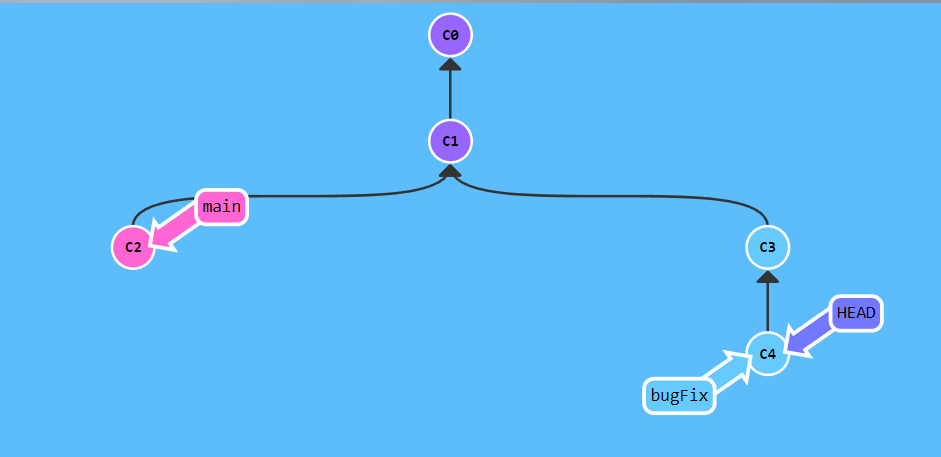
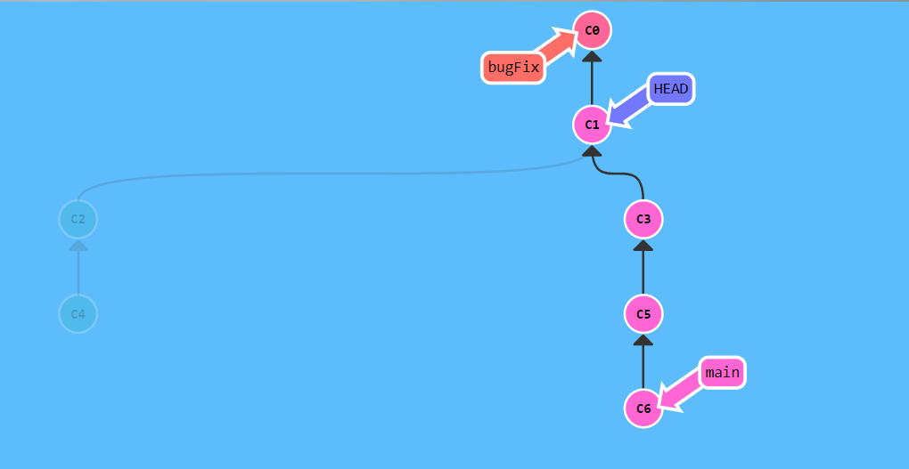
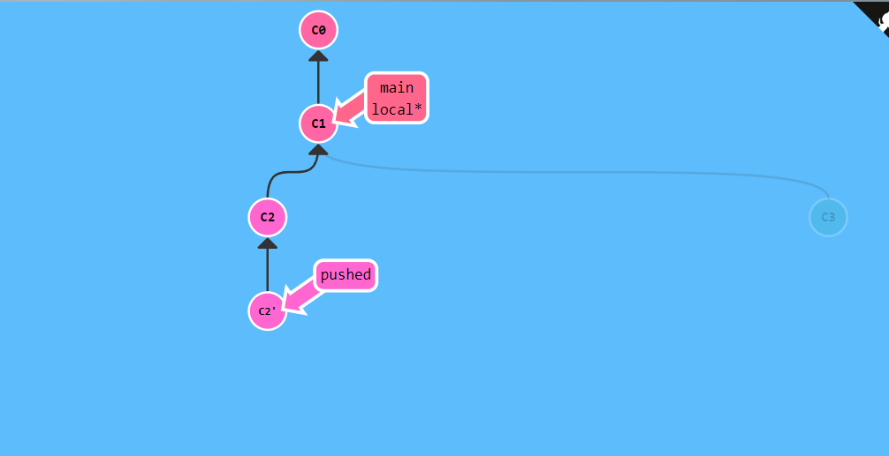

# 实验一 Git和Markdown基础

班级： 21计科3

学号： 202302200000

姓名： 姚义香

Github地址：<https://github.com/blmeue/Python_resources.git>

---

## 实验目的

1. Git基础，使用Git进行版本控制
2. Markdown基础，使用Markdown进行文档编辑

## 实验环境

1. Git
2. VSCode
3. VSCode插件

## 实验内容和步骤

### 第一部分 实验环境的安装

1. 安装git，从git官网下载后直接点击可以安装：[git官网地址](https://git-scm.com/)
2. 从Github克隆课程的仓库：[课程的仓库地址](https://github.com/zhoujing204/python_course)，运行git bash应用（该应用包含在git安装包内），在命令行输入下面的命令（命令运行成功后，课程仓库会默认存放在Windows的用户文件夹下）

```bash
git clone https://github.com/zhoujing204/python_course.git
```

如果你在使用`git clone`命令时遇到SSL错误，请运行下面的git命令(这里假设你的Git使用了默认安装目录)：

```bash
git config --global http.sslCAInfo "C:/Program Files/Git/mingw64/ssl/certs/ca-bundle.crt"
```

或者运行下面的命令:

```bash
git config --global http.sslVerify false
```

如果遇到错误：`error setting certificate file`，请运行下面的命令重新指定git的安全证书：

```bash
git config --global --unset http.sslCAInfo
git config --global http.sslCAInfo "C:/Program Files/Git/mingw64/ssl/certs/ca-bundle.crt"
```

该仓库的课程材料后续会有更新，如果需要更新课程材料，可以在本地课程仓库的目录下运行下面的命令：

```bash
git pull
```

在本地的仓库内容有更新后，可以运行下面的命令，将本地仓库的内容和远程仓库的内容同步：

```bash
git push origin main
```

3. 注册Github账号或者Gitee帐号，创建一个新的仓库，使用上面同样的方法将该仓库clone到本地，用于存放实验报告和实验代码，使用`git pull`和`git push`命令保持远程仓库和本地仓库的同步。
4. 安装VScode，下载地址：[Visual Studio Code](https://code.visualstudio.com/)
5. 安装下列VScode插件
   - GitLens
   - Git Graph
   - Git History
   - Markdown All in One
   - Markdown Preview Enhanced
   - Markdown PDF
   - Auto-Open Markdown Preview
   - Paste Image
   - markdownlint

### 第二部分 Git基础

教材《Python编程从入门到实践》P440附录D：使用Git进行版本控制，按照教材的步骤，完成Git基础的学习。

### 第三部分 learngitbranching.js.org

访问[learngitbranching.js.org](https://learngitbranching.js.org)，如下图所示完成Main部分的Introduction Sequence和Ramping Up两个小节的学习。



上面你学习到的git命令基本上可以应付百分之九十以上的日常使用，如果你想继续深入学习git，可以：

- 继续学习[learngitbranching.js.org](https://learngitbranching.js.org)后面的几个小节（包括Main和Remote）
- 在日常的开发中使用git来管理你的代码和文档，用得越多，记得越牢
- 在git使用过程中，如果遇到任何问题，例如：错误删除了某个分支、从错误的分支拉取了内容等等，请查询[git-flight-rules](https://github.com/k88hudson/git-flight-rules)

### 第四部分 Markdown基础

查看[Markdown cheat-sheet](http://www.markdownguide.org/cheat-sheet)，学习Markdown的基础语法

使用Markdown编辑器（例如VScode）编写本次实验的实验报告，包括[实验过程与结果](#实验过程与结果)、[实验考查](#实验考查)和[实验总结](#实验总结)，并将其导出为 **PDF格式** 来提交。

如何将markdown文件转换为pdf格式的文件？

- 安装vscode插件Markdown PDF，安装后重启vscode，打开markdown文件，按下`Ctrl+Shift+P`，输入`Markdown PDF: Export (pdf)`，回车即可导出pdf文件。
- 使用Google Chrome浏览器，在Github网站或者Gitee网站打开你的仓库，浏览你的markdown文件，按下`Ctrl+P`，选择`打印`，选择`目标打印机`为`另存为PDF`，点击`保存`即可导出pdf文件。

## 实验过程与结果

1. 执行两次"go commit"命令  
   (1) 显示效果:

   

   (2) 实验代码:

    ```bash
     git commit
     git commit
    ```

2. 用'git branch <分支名>'来创建分支，用'git checkout <分支名>'来切换分支

   (1) 显示效果:

   

   (2) 实验代码:

    ```bash
    git branch bugFix
    git checkout bugFix
    ```

3. 把bugFix合并到main里  
   (1) 显示效果:

   ~

   (2) 实验代码:

   ```bash
    git branch bugFix
    git checkout bugFix
    git commit
    git checkout main
    git commit
    git merge bugFix
    ```

4. 把bugFix分支里面的工作直接移到main分支上  
   (1) 实验效果图:

   

   (2)实验代码如下:

   ```bash
    git branch bugFix
    git checkout bugFix
    git commit
    git checkout main
    git commit
    git checkout bugFix
    git rebase main
    ```

5. 分离的HEAD  
   (1) 实验效果图:

    

   (2) 实验代码如下:

   ```bash
    git checkout c4
    ```

6. 用HEAD在提交树中向上移动几次  
   (1) 实验效果图:

   

   (2)实验代码如下:

   ```bash
    git checkout c3
    ```

7. 通过'git branch -f' 命令移动main、bugFix、HEAD到目标所示位置

   (1) 实验效果图:

   

   (2)实验代码:

   ```bash
    git checkout c4
    git branch -f main c6
    git checkout c5
    git branch -f bugFix c0
    git checkout c1
    ```

8. 分别撤销local分支和pushed分支上的最近一次提交
   
   (1) 实验效果图:

   

   (2) 实验代码:

   ```bash
    git checkout pushed
    git revert pushed
    git checkout local
    git branch -f local c1
    ```

## 实验考查

请使用自己的语言回答下面的问题，这些问题将在实验检查时用于提问和答辩，并要求进行实际的操作。

1. 什么是版本控制？使用Git作为版本控制软件有什么优点？  
   答：(1)版本控制是一种在开发过程中用于管理我们对文件、目录或工程等内容的修改历史，方便查看更改历史记录，备份以便恢复以前的版本软件工程技术。这使得开发团队可以轻松地跟踪和管理代码的更改，同时还可以方便地回滚到任何一个版本。(2)优点：分布式、速度快、强大的分支管理、可追溯性、安全性、支持大规模开发。
2. 如何使用Git撤销还没有Commit的修改？如何使用Git检出（Checkout）已经以前的Commit？（实际操作）  
   答：撤销:使用git checkout命令取消特定文件的修改:git checkout --filename;使用git reset命令取消所有文件的修改：git reset HEAD。检测以前的commit:首先，通过git log命令查看提交历史的commit id，然后使用以下命令检出到指定的commit：
3. Git中的HEAD是什么？如何让HEAD处于detached HEAD状态？（实际操作）  
   答：Git中的HEAD是一个指针，它指向当前所在的分支的最新提交或者分支。可以通过以下步骤让HEAD处于detached HEAD状态：(1)使用git log命令查看提交历史，并找到你想要检出的特定提交的commit ID或哈希值。(2)然后，使用git checkout命令检出到该提交，而不是分支：git checkout <commit-ID> (3)将HEAD置于detached HEAD状态。你可以通过运行git status命令来确认,如果看到输出中的"HEAD detached at <commit-ID>"，那么你已经成功地将HEAD置于detached HEAD状态
4. 什么是分支（Branch）？如何创建分支？如何切换分支？（实际操作）  
   答：在Git中，分支是指从主线上分离出来进行另外的操作，既不影响主线，主线又可以继续进行。它可用来解决临时需求，当分支的任务完成后可以合并到主线上，而分支的任务完成可以删掉。在命令行中，使用git branch命令可以创建一个分支。在命令行中，使用git checkout命令可以切换到指定的分支。
5. 如何合并分支？git merge和git rebase的区别在哪里？（实际操作）  
   答：(1)合并分支：在Git中合并分支有两种常见的方法：git merge和git rebase。git merge的合并原理是找到两个分支的最近公共祖先，然后将指定分支在公共祖先之后的所有提交合并到当前分支上。这种方式的合并结果通常是一个新的提交，它包含了两个分支的差异。而git rebase则是另一种合并分支的方式，它的工作原理是将当前分支的提交记录迁移到目标分支上，并形成一个新的提交。这种方式的合并结果通常是一条连续的提交记录，它保留了分支的历史记录。(2)区别：git merge和git rebase的主要区别在于它们处理分支的方式。git merge会将指定分支的新提交和当前分支的新提交合并，生成一个新的提交。而git rebase则是将当前分支的新提交应用到目标分支上，生成一个新的提交，并将原分支上的提交删除。也就是说，如果使用git merge，两个分支的提交历史都会被保留；而如果使用git rebase，那么原分支的提交历史将会被删除。
6. 如何在Markdown格式的文本中使用标题、数字列表、无序列表和超链接？（实际操作）  
   答：(1)创建标题:你可以使用井号(#)来创建不同级别的标题。#的个数表示标题的级别。(2)创建数字列表:你可以在列表项前面添加数字，并以空格或制表符进行缩进。(3)创建无序列表:在无序列表中，你可以使用短横线(-)、加号(+)或星号(*)来标记列表项。(4)创建超链接:你可以使用方括号来创建超链接，方括号中的内容会被视为链接的名称，而圆括号的内容会被视为链接的地址。

## 实验总结

在本次实验过程中，我学会了如何将github仓库里的东西克隆、更新到本地仓库中，以及如何将本地仓库里的东西更新上传到github仓库中。与此同时，还学会和掌握了一些gitmanage命令，如git commit、git checkout、git rebase等。
