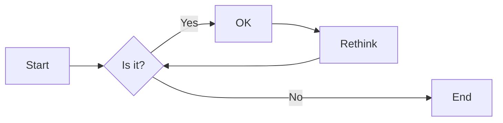
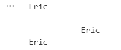
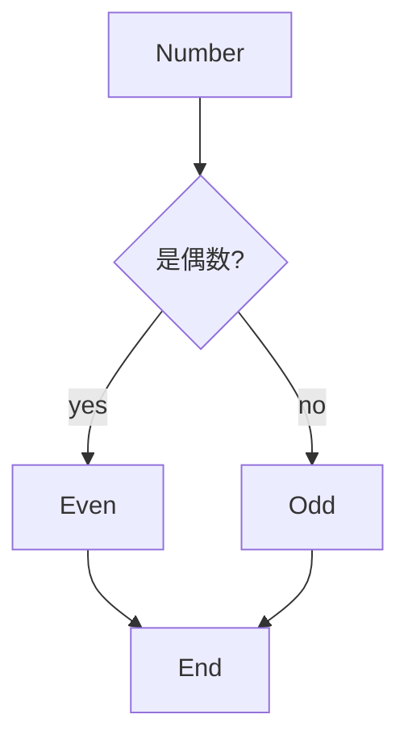

# 实验二 Python变量、简单数据类型

班级： 21计科3班

学号： 20210302310

姓名： 姚义香

Github地址：<https://github.com/blmeue/Python_resources.git>

CodeWars地址：<https://www.codewars.com/users/blmeue>

---

## 实验目的

1. 使用VSCode编写和运行Python程序
2. 学习Python变量和简单数据类型

## 实验环境

1. Git
2. Python 3.10
3. VSCode
4. VSCode插件

## 实验内容和步骤

### 第一部分

实验环境的安装

1. 安装Python，从Python官网下载Python 3.10安装包，下载后直接点击可以安装：[Python官网地址](https://www.python.org/downloads/)
2. 为了在VSCode集成环境下编写和运行Python程序，安装下列VScode插件
   - Python
   - Python Environment Manager
   - Python Indent
   - Python Extended
   - Python Docstring Generator
   - Jupyter
   - indent-rainbow
   - Jinja

---

### 第二部分

Python变量、简单数据类型和列表简介

完成教材《Python编程从入门到实践》下列章节的练习：

- 第2章 变量和简单数据类型

---

### 第三部分

在[Codewars网站](https://www.codewars.com)注册账号，完成下列Kata挑战：

---

#### 第1题：求离整数n最近的平方数（Find Nearest square number）

难度：8kyu

你的任务是找到一个正整数n的最近的平方数
例如，如果n=111，那么nearest_sq(n)（nearestSq(n)）等于121，因为111比100（10的平方）更接近121（11的平方）。
如果n已经是完全平方（例如n=144，n=81，等等），你需要直接返回n。
代码提交地址
<https://www.codewars.com/kata/5a805d8cafa10f8b930005ba>

---

#### 第2题：弹跳的球（Bouncing Balls）

难度：6kyu

一个孩子在一栋高楼的第N层玩球。这层楼离地面的高度h是已知的。他把球从窗口扔出去。球弹了起来,  例如:弹到其高度的三分之二（弹力为0.66）。他的母亲从离地面w米的窗户向外看,母亲会看到球在她的窗前经过多少次（包括球下落和反弹的时候）？

一个有效的实验必须满足三个条件：

- 参数 "h"（米）必须大于0
- 参数 "bounce "必须大于0且小于1
- 参数 “window "必须小于h。

如果以上三个条件都满足，返回一个正整数，否则返回-1。
**注意:只有当反弹球的高度严格大于窗口参数时，才能看到球。**
代码提交地址
<https://www.codewars.com/kata/5544c7a5cb454edb3c000047/train/python>

---

#### 第3题： 元音统计(Vowel Count)

难度： 7kyu

返回给定字符串中元音的数量（计数）。对于这个Kata，我们将考虑a、e、i、o、u作为元音（但不包括y）。输入的字符串将只由小写字母和/或空格组成。

代码提交地址：
<https://www.codewars.com/kata/54ff3102c1bad923760001f3>

---

#### 第4题：偶数或者奇数（Even or Odd）

难度：8kyu

创建一个函数接收一个整数作为参数，当整数为偶数时返回”Even”当整数位奇数时返回”Odd”。
代码提交地址：
<https://www.codewars.com/kata/53da3dbb4a5168369a0000fe>

### 第四部分

使用Mermaid绘制程序流程图

安装Mermaid的VSCode插件：

- Markdown Preview Mermaid Support
- Mermaid Markdown Syntax Highlighting

使用Markdown语法绘制你的程序绘制程序流程图（至少一个），Markdown代码如下：


显示效果如下：



查看Mermaid流程图语法-->[点击这里](https://mermaid.js.org/syntax/flowchart.html)

使用Markdown编辑器（例如VScode）编写本次实验的实验报告，包括[实验过程与结果](#实验过程与结果)、[实验考查](#实验考查)和[实验总结](#实验总结)，并将其导出为 **PDF格式** 来提交。

## 实验过程与结果

请将实验过程与结果放在这里，包括：

- [第二部分 Python变量、简单数据类型和列表简介](#第二部分)
  1. 练习2.1: 简单消息  
        (1) 实验代码：

        ```python
        message="hello world"
        print(message)
        ```

        （2）实验结果：  

        hello world

  2. 练习2.2：多条简单消息  

        (1) 实验代码：

        ```python
        message="hello world"
        print(message)
        message="how are you"
        print(message)
        ```

        (2) 实验结果：

        hello world  
        how are you?

  3. 练习2.3：个性化消息  
        (1) 实验代码：

        ```python
        name="Eric"
        message=f"Hello {name},would you like to learn some Python today?"
        print(message)
        ```

        (2) 实验结果：

        Hello Eric,would you like to learn some Python today?

  4. 练习2.4：调整名字的大小写  
        (1) 实验代码：

        ```python
        name='eRic'
        print(name.lower())
        print(name.upper())
        print(name.title())
        ```

        (2) 实验结果：

        eric  
        ERIC  
        Eric

  5. 练习2.5： 名言1  
        (1) 实验代码：

        ```python
        name="Albert Einstein"
        saying = "A person who never made a mistake never tried anything new."
        print(f"{name}: \"{saying }\" ")
        ```

        (2) 实验结果：

        Albert Einstein: "A person who never made a mistake never tried anything new."

  6. 练习2.6： 名言2  
        (1) 实验代码：

        ```python
        famous_person="Albert Einstein"
        famous_saying = "A person who never made a mistake never tried anything new."
        message=f"{famous_person}: \"{famous_saying }\" "
        print(message)
        ```

        (2) 实验结果：

        Albert Einstein: "A person who never made a mistake never tried anything new."

  7. 练习2.7：删除人名中的空白  
        (1) 实验代码：

        ```python
        name="\t   Eric  \n "
        print(name.lstrip())
        print(name.rstrip())
        print(name.strip())
        ```

        (2) 实验结果：

        

  8. 练习2.8：文件扩展名  
        (1) 实验代码：

        ```python
        filename='python_notes.txt'
        print(filename.removesuffix('.txt'))
        ```

        (2) 实验结果：

        python_notes

  9. 练习2.9：数字8  
        (1) 实验代码：

        ```python
        print(5+3)
        print(10-2)
        print(4*2)
        print(16/2)
        ```

        (2) 实验结果：

        8  
        8  
        8  
        8.0

  10. 练习2.10：最喜欢的数  
        (1) 实验代码：

        ```python
        number=10
        print(f"My favorite number is {number}")
        ```

        (2) 实验结果：

        My favorite number is 10

- [第三部分 Codewars Kata挑战](#第三部分)
  
  1. 第1题：求离整数n最近的平方数（Find Nearest square number）

        (1) 实验代码:

        ```python
        def nearest_sq(n):
            return round(n**0.5,0)**2
        ```

        (2) 实验结果:  
            Test Results:  
            Fixed Tests  
            Basic Test Cases  
            (5 of 5 Assertions)  
            Completed in 0.12ms  
            Random Tests  
            Small Random Tests  
            (100 of 100 Assertions)  
            Big Random Tests  
            (1000 of 1000 Assertions)  
            Completed in 17.22ms  
            You have passed all of the tests! :)  

  2. 第2题：弹跳的球（Bouncing Balls）

        (1) 实验代码:

        ```python
        def bouncing_ball(h, bounce, window):
            # your code
            sum=1
            see_h=bounce*h
            if h>0 and (bounce>0 and bounce<1) and window <h:
                while window<see_h:
                        sum +=2
                        see_h=see_h*bounce
                return sum
            return -1
        ```

        (2) 实验结果:  
            Test Results:  
            Tests  
            Fixed Tests  
            (11 of 11 Assertions)  
            Random tests  
            (50 of 50 Assertions)  
            Completed in 2.71ms  
            You have passed all of the tests! :)  

  3. 第3题： 元音统计(Vowel Count)

        (1)实验代码:

        ```python
        
        def get_count(sentence):
            return sentence.count('a')+sentence.count('e')+sentence.count('i')+sentence.count('o')+sentence.count('u')
            pass
        ```

        (2)实验结果:  
            Test Results:  
            Sample tests  
            Should count all vowels  
            Should not count "y"  
            Should return 0 when no vowels  
            Should return 0 for empty string  
            Should return 5 for "abracadabra"  
            Completed in 0.22ms  
            Random tests  
            Random tests  
            (100 of 100 Assertions)  
            Completed in 11.10ms  
            You have passed all of the tests! :)  

  4. 第4题：偶数或者奇数（Even or Odd）

        (1) 实验代码:

        ```python
            def even_or_odd(number):
            if number%2 ==0:
                return "Even"
            return "Odd"
        ```

        (2) 实验结果:  
            Test Results:  
            Fixed Tests  
            Basic Test Cases  
            (11 of 11 Assertions)  
            Completed in 0.23ms  
            Random Tests  
            You have passed all of the tests! :)

- [第四部分 使用Mermaid绘制程序流程图](#第四部分)



## 实验考查

请使用自己的语言并使用尽量简短代码示例回答下面的问题，这些问题将在实验检查时用于提问和答辩以及实际的操作。

1. Python中的简单数据类型有那些？我们可以对这些数据类型做哪些操作？  
   答：(1) 简单数据类型：整型、浮点型、布尔型、字符串、空值。  
       (2) 操作：算术运算、比较运算、逻辑运算、成员运算、身份运算、位运算、赋值运算、运算符
2. 为什么说Python中的变量都是标签？  
   答：在Python中，变量被视为标签，这是因为变量实际上是指向存储在内存中的对象的引用。换句话说，变量本身并不存储值，而是存储了对值的引用。
3. 有哪些方法可以提高Python代码的可读性？  
   答 (1) 合理使用空格。  
       (2) 合理使用注释。  
       (3) 合理使用缩进。  
       (4) 合理使用换行。  
       (5) 合理使用有意义的函数名、变量名、类名。  

## 实验总结

在本次的实验过程中，我更加熟练的掌握了Python语言的语法，理解到更多的python函数，对python变量的操作更加熟练，也对Python语言的特性有了更深的理解。同时也更加熟悉Visual Studio Code的使用，能够熟练的进行代码的编写和调试。
