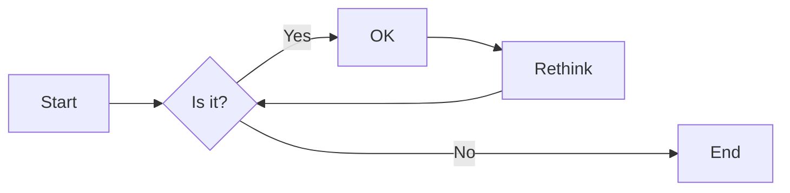
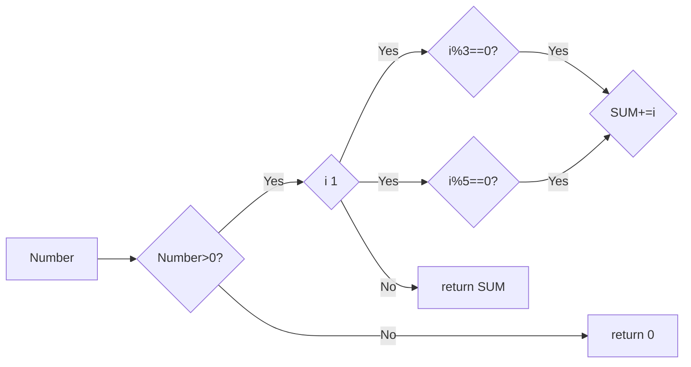

# 实验三 Python列表

班级： 21计科3班

学号： 20210302310

姓名： 姚义香

Github地址：<https://github.com/blmeue/Python_resources.git>

CodeWars地址：<https://www.codewars.com/users/blmeue>

---

## 实验目的

1. 学习Python的简单使用和列表操作
2. 学习Python中的if语句

## 实验环境

1. Git
2. Python 3.10
3. VSCode
4. VSCode插件

## 实验内容和步骤

### 第一部分

Python列表操作

完成教材《Python编程从入门到实践》下列章节的练习：

- 第3章 列表简介
- 第4章 操作列表
- 第5章 if语句

---

### 第二部分

在[Codewars网站](https://www.codewars.com)注册账号，完成下列Kata挑战：

---

#### 第一题：3和5的倍数（Multiples of 3 or 5）

难度： 6kyu

如果我们列出所有低于 10 的 3 或 5 倍数的自然数，我们得到 3、5、6 和 9。这些数的总和为 23. 完成一个函数，使其返回小于某个整数的所有是3 或 5 的倍数的数的总和。此外，如果数字为负数，则返回 0。

注意：如果一个数同时是3和5的倍数，应该只被算一次。

**提示：首先使用列表解析得到一个列表，元素全部是3或者5的倍数。
使用sum函数可以获取这个列表所有元素的和.**

代码提交地址：
<https://www.codewars.com/kata/514b92a657cdc65150000006>

---

#### 第二题： 重复字符的编码器（Duplicate Encoder）

难度： 6kyu

本练习的目的是将一个字符串转换为一个新的字符串，如果新字符串中的每个字符在原字符串中只出现一次，则为"("，如果该字符在原字符串中出现多次，则为")"。在判断一个字符是否是重复的时候，请忽略大写字母。

例如:

```python
"din"      =>  "((("
"recede"   =>  "()()()"
"Success"  =>  ")())())"
"(( @"     =>  "))(("
```

代码提交地址:
<https://www.codewars.com/kata/54b42f9314d9229fd6000d9c>

---

#### 第三题：括号匹配（Valid Braces）

难度：6kyu

写一个函数，接收一串括号，并确定括号的顺序是否有效。如果字符串是有效的，它应该返回True，如果是无效的，它应该返回False。
例如：

```python
"(){}[]" => True 
"([{}])" => True
 "(}" => False
 "[(])" => False 
"[({})](]" => False
```

**提示：
python中没有内置堆栈数据结构，可以直接使用`list`来作为堆栈，其中`append`方法用于入栈，`pop`方法可以出栈。**

代码提交地址
<https://www.codewars.com/kata/5277c8a221e209d3f6000b56>

---

#### 第四题： 从随机三元组中恢复秘密字符串(Recover a secret string from random triplets)

难度： 4kyu

有一个不为你所知的秘密字符串。给出一个随机三个字母的组合的集合，恢复原来的字符串。

这里的三个字母的组合被定义为三个字母的序列，每个字母在给定的字符串中出现在下一个字母之前。"whi "是字符串 "whatisup "的一个三个字母的组合。

作为一种简化，你可以假设没有一个字母在秘密字符串中出现超过一次。

对于给你的三个字母的组合，除了它们是有效的三个字母的组合以及它们包含足够的信息来推导出原始字符串之外，你可以不做任何假设。特别是，这意味着秘密字符串永远不会包含不出现在给你的三个字母的组合中的字母。

测试用例：

```python
secret = "whatisup"
triplets = [
  ['t','u','p'],
  ['w','h','i'],
  ['t','s','u'],
  ['a','t','s'],
  ['h','a','p'],
  ['t','i','s'],
  ['w','h','s']
]
test.assert_equals(recoverSecret(triplets), secret)
```

代码提交地址：
<https://www.codewars.com/kata/53f40dff5f9d31b813000774/train/python>

提示：

- 利用集合去掉`triplets`中的重复字母，得到字母集合`letters`，最后的`secret`应该由集合中的字母组成，`secret`长度也等于该集合。

```python
letters = {letter for triplet in triplets for letter in triplet }
length = len(letters)
```

- 创建函数`check_first_letter(triplets, first_letter)`，检测一个字母是不是secret的首字母，返回True或者False。
- 创建函数`remove_first_letter(triplets, first_letter)`,  从三元组中去掉首字母，返回新的三元组。
- 遍历字母集合letters，利用上面2个函数得到最后的结果`secret`。

---

#### 第五题： 去掉喷子的元音（Disemvowel Trolls）

难度： 7kyu

喷子正在攻击你的评论区!
处理这种情况的一个常见方法是删除喷子评论中的所有元音(字母：a,e,i,o,u)，以消除威胁。
你的任务是写一个函数，接收一个字符串并返回一个去除所有元音的新字符串。
例如，字符串 "This website is for losers LOL!"   将变成 "Ths wbst s fr lsrs LL!".

注意：对于这个Kata来说，y不被认为是元音。
代码提交地址：
<https://www.codewars.com/kata/52fba66badcd10859f00097e>

提示：

- 首先使用列表解析得到一个列表，列表中所有不是元音的字母。
- 使用字符串的join方法连结列表中所有的字母，例如：

```python
last_name = "lovelace"
letters = [letter for letter in last_name ]
print(letters) # ['l', 'o', 'v', 'e', 'l', 'a', 'c', 'e']
name = ''.join(letters) # name = "lovelace"
```

---

### 第三部分

使用Mermaid绘制程序流程图

安装VSCode插件：

- Markdown Preview Mermaid Support
- Mermaid Markdown Syntax Highlighting

使用Markdown语法绘制你的程序绘制程序流程图（至少一个），Markdown代码如下：


显示效果如下：



查看Mermaid流程图语法-->[点击这里](https://mermaid.js.org/syntax/flowchart.html)

使用Markdown编辑器（例如VScode）编写本次实验的实验报告，包括[实验过程与结果](#实验过程与结果)、[实验考查](#实验考查)和[实验总结](#实验总结)，并将其导出为 **PDF格式** 来提交。

## 实验过程与结果

请将实验过程与结果放在这里，包括：

- [第一部分 Python列表操作和if语句](#第一部分)
  
  1.练习3.1：姓名  
  (1) 实验代码：

  ```python
  names=["Albert","Einstein","Marie","Curie","Tsung-Dao","Lee"]
  for name in names:
      print(name)
  ```

  (2) 实验结果：
  Albert
  Einstein
  Marie
  Curie
  Tsung-Dao
  Lee

  2.练习3.2：问候语  
  (1) 实验代码：

  ```python
  #names=["Albert","Einstein","Marie","Curie","Tsung-Dao","Lee"]
  for name in names:
      print(f"{name},how are you?")
  ```

  (2) 实验结果：
  Albert,how are you?  
  Einstein,how are you?  
  Marie,how are you?  
  Curie,how are you?  
  Tsung-Dao,how are you?  
  Lee,how are you?  
  3.练习3.3：自己的列表  
  (1) 实验代码：

  ```python
  ways=["Honda motorcycle","car"]
  for way in ways:
      print(f"I would like to own a {way}.")
  ```

  (2) 实验结果：  
  I would like to own a Honda motorcycle.  
  I would like to own a car.  
  4.练习3.4：嘉宾名单  
  (1) 实验代码：

  ```python
  guests=["Albert","Einstein","Marie"]
  for person in guests:
      print(f"{person},please come to my dinner")
  ```

  (2) 实验结果：  
  Albert,please come to my dinner  
  Einstein,please come to my dinner  
  Marie,please come to my dinner  
  5.练习3.5：修改嘉宾名单  
  (1) 实验代码：  

  ```python
  cannot_attend="Albert"
  guests=["Albert","Einstein","Marie"]
  print(f"Sorry to hear that {cannot_attend} can not attend")
  new_guest="Mary"
  guests[guests.index(cannot_attend)]=new_guest
  for guest in guests:
      print(f"{guest},please come to my dinner")
  ```

  (2) 实验结果：  
  Sorry to hear that Albert can not attend  
  Mary,please come to my dinner  
  Einstein,please come to my dinner  
  Marie,please come to my dinner  
  6.练习3.6：添加嘉宾名单  
  (1) 实验代码：

  ```python
  print("I found a bigger table")
  guests=["Albert","Einstein","Marie"]
  guests.insert(0,"Jane")#在列表开头添加元素
  guests.insert(2,"Mary")#在列表中间添加元素
  guests.append("Jack")#在列表末尾添加元素
  for guest in guests:
      print(f"{guest},please come to my dinner")
  ```

  (2) 实验结果：  
  I found a bigger table  
  Jane,please come to my dinner  
  Albert,please come to my dinner  
  Mary,please come to my dinner  
  Einstein,please come to my dinner  
  Marie,please come to my dinner  
  Jack,please come to my dinner  
  7.练习3.7：缩短名单  
  (1) 实验代码：

  ```python
  print("Sorry!I can only invite two guests")
  guests=["Jane","Albert","Mary","Einstein","Marie","Jack"]
  while len(guests)>2:
      print(f"Sorry {guests.pop()},I can not invite you")
  for guest in guests:
      print(f"Dear {guest}, You are still invited to my dinner!")
  del guests[:]#删除列表里面所有的元素
  print(guests)
  ```

  (2) 实验结果：  
  Sorry!I can only invite two guests  
  Sorry Jack,I can not invite you  
  Sorry Marie,I can not invite you  
  Sorry Einstein,I can not invite you  
  Sorry Mary,I can not invite you  
  Dear Jane, You are still invited to my dinner!  
  Dear Albert, You are still invited to my dinner!  
  []
  8.练习3.8：放眼世界  
  (1) 实验代码：  

  ```python
  cities=["Beijing","Shanghai","Guangzhou","Shenzhen","HongKong","Macao"]
  print(cities)
  print(sorted(cities))#使用sorted()按字母顺序打印这个列表
  print(cities)
  print(sorted(cities,reverse=True))#使用sorted()按字母顺序相反的顺序打印这个列表
  print(cities)
  cities.reverse()#修改列表元素的排列顺序,反转列表元素的排列顺序
  print(cities)
  cities.reverse()#再次修改列表元素的排列顺序。打印该列表，核实排列顺序又恢复到原来的排序列表
  print(cities)
  cities.sort()#修改该列表，使其元素按字母顺序排列
  print(cities)
  cities.sort(reverse=True)#修改该列表，使其元素按与字母顺序相反的顺序排列
  print(cities)
  ```

  (2) 实验结果：  
  ['Beijing', 'Shanghai', 'Guangzhou', 'Shenzhen', 'HongKong', 'Macao']  
  ['Beijing', 'Guangzhou', 'HongKong', 'Macao', 'Shanghai', 'Shenzhen']  
  ['Beijing', 'Shanghai', 'Guangzhou', 'Shenzhen', 'HongKong', 'Macao']  
  ['Shenzhen', 'Shanghai', 'Macao', 'HongKong', 'Guangzhou', 'Beijing']  
  ['Beijing', 'Shanghai', 'Guangzhou', 'Shenzhen', 'HongKong', 'Macao']  
  ['Macao', 'HongKong', 'Shenzhen', 'Guangzhou', 'Shanghai', 'Beijing']  
  ['Beijing', 'Shanghai', 'Guangzhou', 'Shenzhen', 'HongKong', 'Macao']  
  ['Beijing', 'Guangzhou', 'HongKong', 'Macao', 'Shanghai', 'Shenzhen']  
  ['Shenzhen', 'Shanghai', 'Macao', 'HongKong', 'Guangzhou', 'Beijing']  
  9.练习2.9：晚餐嘉宾  
  (1) 实验代码：

  ```python
  guests=["Jane","Albert","Mary","Einstein","Marie","Jack"]#练习3.6邀请的嘉宾
  print(f"You have invited {len(guests)} guests to have dinner")
  ```

  (2) 实验结果：  
  You have invited 6 guests to have dinner  
  10.练习2.10：尝试使用各个函数  
  (1) 实验代码：

  ```python
  lists=["Mountains","Rivers","Country","City","Language","Love"]
  print(f"The number of lists is {len(lists)}!")#队列长度
  print(sorted(lists))#按照字母顺进行打印
  print(sorted(lists,reverse=True))#使用sorted函数对列表按照字母顺序相反的顺序进行打印
  lists.reverse()#利用reverse()函数反省打印列表
  print(lists)
  lists.sort()#sort()方法按字母升序排序
  print(lists)
  lists.sort(reverse=True)#sort(reverse=True)方法按字母降序排序
  print(lists)
  lists.remove("Love")#删除Love
  print(lists)
  lists.pop(2)#pop(i)删除位置i的元素
  print(lists)
  lists.pop()#删除列表末尾元素
  print(lists)
  del lists[1]#删除第二个元素
  print(lists)
  lists.append('Mountain')#在列表末尾添加元素
  print(lists)
  lists.insert(1,'Stars')#在列表任意位置插入元素
  print(lists)
  lists[1]='Animal'#修改列表元素
  print(lists)
  ```

  (2) 实验结果：  
  The number of lists is 6!  
  ['City', 'Country', 'Language', 'Love', 'Mountains', 'Rivers']  
  ['Rivers', 'Mountains', 'Love', 'Language', 'Country', 'City']  
  ['Love', 'Language', 'City', 'Country', 'Rivers', 'Mountains']  
  ['City', 'Country', 'Language', 'Love', 'Mountains', 'Rivers']  
  ['Rivers', 'Mountains', 'Love', 'Language', 'Country', 'City']  
  ['Rivers', 'Mountains', 'Language', 'Country', 'City']  
  ['Rivers', 'Mountains', 'Country', 'City']  
  ['Rivers', 'Mountains', 'Country']  
  ['Rivers', 'Country']  
  ['Rivers', 'Country', 'Mountain']  
  ['Rivers', 'Stars', 'Country', 'Mountain']  
  ['Rivers', 'Animal', 'Country', 'Mountain']  

  11.练习3.11：有意引发错误  
  (1) 实验代码:

  ```python
  my_list=[1,2,3,4,5]
  #试图访问列表中第七个元素，这个将引发索引错误
  #print(my_list[6])
  #修改后
  print(my_list[4])
  ```

  (2) 实验结果：  
  5

  12.练习4.1:比萨  
  (1) 实验代码：

  ```python
    pizzas=['pepperoni pizza','chicken pizza','vegetable pizza']
    for pizza in pizzas:
        print(f"I like {pizza}")
    print(f"I really like pizza!")
  ```

  (2) 实验结果：  
    I like pepperoni pizza  
    I like chicken pizza  
    I like vegetable pizza  
    I really like pizza!  

  13.练习4.2：动物  
  (1) 实验代码：

  ```python
    Animals=['dog','cat','tiger']
    for animal in Animals:
        print(f"A {animal} would make a great pet.")
    print(f"Any of these animals would make a great pet!")
  ```

  (2) 实验结果：  
    A dog would make a great pet.  
    A cat would make a great pet.  
    A tiger would make a great pet.  
    Any of these animals would make a great pet!  

  14.练习4.3：数到20  
  (1) 实验代码：

  ```python
  for i in range(1,20):
    print(i)
  ```

  (2) 实验结果：
    1  
    2  
    3  
    4  
    5  
    6  
    7  
    8  
    9  
    10  
    11  
    12  
    13  
    14  
    15  
    16  
    17  
    18  
    19  

  15.练习4.4：100万  
  (1) 实验代码：

  ```python
    list =[i for i in range(1,1000001)]
    for i in list:
        print(i)
  ```

  (2) 实验结果：  
  1  
  2  
  3  
  4  
  5  
  6  
  7  
  ....  
  1000000  

  16.练习4.5：100万求和  
  (1) 实验代码：

  ```python
  list=[i for i in range(1,1000001)]
  print(min(list))
  print(max(list))
  print(sum(list))
  ```

  (2) 实验结果：  
  1  
  1000000  
  500000500000  

  17.练习4.6：奇数  
  (1) 实验代码：

  ```python
  lists=[i for i in range(1,21,2)]
  for list in lists:
      print(list)
  ```

  (2) 实验结果：  
  1  
  3  
  5  
  7  
  9  
  11  
  13  
  15  
  17  
  19  

  18.练习4.7：3的倍数  
  (1) 实验代码：

  ```python
  lists=[i for i in range(3,31,3)]
  for list in lists:
      print(list)
  ```

  (2) 实验结果：  
  3  
  6  
  9  
  12  
  15  
  18  
  21  
  24  
  27  
  30

  19.练习4.8:立方
  (1) 实验代码：

  ```python
  lists=[i**3 for i in range(1,11)]
  for list in lists:
      print(list)
  ```

  (2) 实验结果：  
    1  
    8  
    27  
    64  
    125  
    216  
    343  
    512  
    729  
    1000  
  20.练习4.9:立方推导式  
  (1) 实验代码：

  ```python
  lists=[i**3 for i in range(1,11)]
  for list in lists:
      print(list)
  ```

  (2) 实验结果  
   1  
  8  
  27  
  64  
  125  
  216  
  343  
  512  
  729  
  1000  

  21.练习4.10:切片  
  (1) 实验代码：

  ```python
  lists=[i**3 for i in range(1,11)]
  print("The first three items in the list are:",lists[:3])
  print("Three items from the middle of the list are:",lists[4:7])
  print("The last three items in the list are:",lists[-3:])
  ```

  (2) 实验结果：  
  The first three items in the list are: [1, 8, 27]  
  Three items from the middle of the list are: [125, 216, 343]  
  The last three items in the list are: [512, 729, 1000]  

  21.练习4.11:你的比萨，我的比萨  
  (1) 实验代码：

  ```python
  friend_pizzas=pizzas[:]
  pizzas.append('pineapple pizza')
  print(pizzas)
  friend_pizzas.append('cheese pizza')
  print(friend_pizzas)
  print("My favorite pizzas are:")
  for pizza in pizzas:
      print(pizza)
  print("\nMy friend's favorite pizzas are:")
  for friend_pizza in friend_pizzas:
      print(friend_pizza)
  ```

  (2) 实验结果：  
  ['pepperoni pizza', 'chicken pizza', 'vegetable pizza', 'pineapple pizza']  
  ['pepperoni pizza', 'chicken pizza', 'vegetable pizza', 'cheese pizza']  
  My favorite pizzas are:  
  pepperoni pizza  
  chicken pizza  
  vegetable pizza  
  pineapple pizza  

  My friend's favorite pizzas are:  
  pepperoni pizza  
  chicken pizza  
  vegetable pizza  
  cheese pizza  

  23.练习4.12:使用多个循环  
  (1) 实验代码：

  ```python
  my_foods=['pizza','falafel','carrot cake']
  friend_foods=my_foods[:]
  my_foods.append('cannoli')
  friend_foods.append('ice cream')
  print("My favorite foods are:")
  for my_food in my_foods:
      print(my_food)
  print("\nMy friend's favorite foods are:")
  for friend_food in friend_foods:
      print(friend_food)
  ```

  (2) 实验结果：  
  My favorite foods are:  
  pizza  
  falafel  
  carrot cake  
  cannoli  

  My friend's favorite foods are:  
  pizza  
  falafel  
  carrot cake  
  ice cream  

  24.练习4.13:自助餐  
  (1) 实验代码：

  ```python
  foods=('pizza','falafel','carrot cake','ice cream','cannoli')
  for food in foods:
      print(food)
  #foods[0]='pasta'
  foods=('pasta','falafel','carrot cake','ice cream','cannoli')
  for food in foods:
      print(food)
  ```

  (2) 实验结果：  
  pizza  
  falafel  
  carrot cake  
  ice cream  
  cannoli  
  pasta  
  falafel  
  carrot cake  
  ice cream  
  cannoli  

  25.练习5.1： 条件测试  
  (1) 实验代码：

  ```python
  car='bmw'
  print("\nIs car=='bmw'?I predict True.")
  print(car=='bmw')
  print("\nIs car=='audi'?I predict False.")
  print(car=='audi')
  foods=['pizza','falafel','carrot cake','cannoli','ice cream']
  print("\nIs 'rice' in foods?I predict False.")
  print('rice' in foods)
  print("\nIs 'pizza' in foods?I predict True.")
  print('pizza' in foods)
  print("\nIs 'beer' in foods?I predict False.")
  print('beer' in foods)
  print("\nIs 'ice cream' in foods?I predict True.")
  print('ice cream' in foods)
  names=["Iron Man","Spider Man","Captain","Ant-Man"]
  print("\nIs 'Iron Man' in names?I predict True.")
  print('Iron Man' in names)
  print("\nIs 'Black Widow' in names?I predict False.")
  print('Black Widow' in names)
  print("\nIs 'Ant-Man' in names?I predict True.")
  print('Ant-Man' in names)
  print("\nIs 'Hulk' in names?I predict False.")
  print('Hulk' in names)
  ```

  (2) 实验结果：  
  Is car=='bmw'?I predict True.  
  True  
  Is car=='audi'?I predict False.  
  False  
  Is 'rice' in foods?I predict False.  
  False  
  Is 'pizza' in foods?I predict True.  
  True  
  Is 'beer' in foods?I predict False.  
  False  
  Is 'ice cream' in foods?I predict True.  
  True  
  Is 'Iron Man' in names?I predict True.  
  True  
  Is 'Black Widow' in names?I predict False.  
  False  
  Is 'Ant-Man' in names?I predict True.  
  True  
  Is 'Hulk' in names?I predict False.  
  False  

  26.练习5.2：更多条件测试  
  (1) 实验代码：

  ```python
  #1检查两个字符串相等和不等。
  car='bmw'
  print(car=='bmw')
  print(car=='audi')

  #2使用函数lower（）测试。
  car='BMW'
  print(car.lower()=='bmw')
  print(car.lower()=='audi')

  #3检查两个数字相等、不等、大于、小于、大于等于和小于等于。
  number_0=50
  print(number_0==50)
  print(number_0!=50)
  print(number_0>40)
  print(number_0<40)
  print(number_0<=50)
  print(number_0>=60)

  #4使用关键字and和or的测试。
  number_0=13
  number_1=23
  print(number_0>=0 and number_1>=10)
  print(number_0>=15 and number_1>=15)
  print(number_0>=15 or number_1>=15)
  print(number_0>=25 or number_1>=25)

  #5试特定的值是否包含在列表中。
  cars=['bmw','audi','subaru']
  print('bmw' in cars)

  #6试特定的值是都未包含在列表中。
  print('toyota' in cars)
  ```

  (2) 实验结果  
  True  
  False  
  True  
  False  
  True  
  False  
  True  
  False  
  True  
  False  
  True  
  False  
  True  
  False  
  True  
  False  

  27.练习5.3：外星人颜色1  
  (1) 实验代码：

  ```python
  alien_color = 'green'
  if alien_color == 'green':
      print("You've earned 5 points!")
  alien_color = 'red'
  if alien_color == 'green':
      print("You've earned 5 points!")
  ```

  (2) 实验结果  
  You've earned 5 points!

  28.练习5.4：外星人颜色2  
  (1) 实验代码：

  ```python
  alien_color = 'green'
  if alien_color == 'green':
      print("You've earned 5 points!")
  alien_color = 'red'
  if alien_color == 'green':
      print("You've earned 5 points!")
  else:
      print("You've earned 10 points!")
  ```

  (2) 实验结果  
  You've earned 5 points!  
  You've earned 10 points!  

  29.练习5.5：外星人颜色3  
  (1) 实验代码：

  ```python
  alien_color=['green','yellow','red']
  for alien in alien_color:
      if alien == 'green':
          print("You've earned 5 points!")
      elif alien == 'yellow':
          print("You've earned 10 points!")
      else:
          print("You've earned 15 points!")
  ```

  (2) 实验结果  
  You've earned 5 points!  
  You've earned 10 points!  
  You've earned 15 points!  

  30.练习5.6：人生的不同阶段  
  (1) 实验代码：

  ```python
  age=23
  if age<2:
      print("This person is an infant.")
  elif 2<=age<4:
      print("This person is a toddler.")
  elif 4<=age<13:
      print("This person is a child.")
  elif 13<=age<18:
      print("This person is a teenager.")
  elif 18<=age<65:
      print("This person is a young adult.")
  else:
      print("This person is an elder.")
  ```

  (2) 实验结果  
  This person is a young adult.  

  31.练习5.7：喜欢的水果  
  (1) 实验代码：

  ```python
  favorite_fruit=['bananas','oranges','apples']
  if 'apples' in favorite_fruit:
      print("You really like apples!")
  if 'bananas' in favorite_fruit:
      print("You really like banans!")
  if 'oranges' in favorite_fruit:
      print("You really like oranges!")
  if 'grapes' in favorite_fruit:
      print("You really like grapes!")
  if 'pears' in favorite_fruit:
      print("You really like pears!")
  ```

  (2) 实验结果  
  You really like apples!  
  You really like banans!  
  You really like oranges!  

  32.练习5.8：以特殊方式跟管理员打招呼
  (1) 实验代码：

  ```python
  users=['admin','Jaden','Aiden','Mason','Ethan']
  for user in users:
      if user=='admin':
          print("Hello admin,would you like to see a status report?")
      else:
          print("Hello "+user+",thank you for logging in again.")
  ```

  (2) 实验结果  
  Hello admin,would you like to see a status report?  
  Hello Jaden,thank you for logging in again.  
  Hello Aiden,thank you for logging in again.  
  Hello Mason,thank you for logging in again.  
  Hello Ethan,thank you for logging in again.  

  33.练习5.9：处理没有用户的情形  
  (1) 实验代码：

  ```python
  users=['admin','Jaden','Aiden','Mason','Ethan']
  if users:
      for user in users:
          if user=='admin':
              print("Hello admin,would you like to see a status report?")
          else:
              print("Hello "+user+",thank you for logging in again.")
  else:
      print("We need to find some users!")
  users=[]
  if users:
      for user in users:
          if user=='admin':
              print("Hello admin,would you like to see a status report?")
          else:
              print("Hello "+user+",thank you for logging in again.")
  else:
      print("We need to find some users!")
  ```

  (2) 实验结果  
  Hello admin,would you like to see a status report?  
  Hello Jaden,thank you for logging in again.  
  Hello Aiden,thank you for logging in again.  
  Hello Mason,thank you for logging in again.  
  Hello Ethan,thank you for logging in again.  
  We need to find some users!  

  34.练习5.10：检查用户名  
  (1) 实验代码：

  ```python
  current_users=['admin','Jaden','Aiden','Mason','Ethan']
  new_users=['admin','Jack','Mason','Ethan','John']
  for new_user in new_users:
      if new_user.lower() in [current_user.lower() for current_user in current_users]:
          print("The username "+new_user+" is already in use,please try another one.")
      else:
          print("The username "+new_user+" is available.")
  ```

  (2) 实验结果  
  The username admin is already in use,please try another one.  
  The username Jack is available.  
  The username Mason is already in use,please try another one.  
  The username Ethan is already in use,please try another one.  
  The username John is available.  

  35.练习5.11：序数  
  (1) 实验代码：

  ```python
  list=[1,2,3,4,5,6,7,8,9]
  for i in list:
      if i==1:
          print("1st")
      elif i==2:
          print("2nd")
      elif i==3:
          print("3rd")
      else:
          print(str(i)+"th")
  ```

  (2) 实验结果  
  1st  
  2nd  
  3rd  
  4th  
  5th  
  6th  
  7th  
  8th  
  9th  

- [第二部分 Codewars Kata挑战](#第二部分)
  
1. 第一题 3和5的倍数（Multiples of 3 or 5）  
    (1) 实验代码：

   ```python
   def solution(number):
    sum=0;
    if number<=0:
        return 0;
    for i in range(1,number):
        if((i%3==0)or(i%5==0)):
            sum+=i;
       
    return sum   
   ```

   (2) 实验结果：  
   Test Results:
    Fixed tests  
    Random tests  
    Random tests  
    (35 of 35 Assertions)  
    Completed in 2.42ms  
    You have passed all of the tests! :)  
2. 第二题： 重复字符的编码器（Duplicate Encoder）
   (1)实验代码：
  
   ```python
   def duplicate_encode(word):
    #your code here
    str=word.lower()
    letter=[]
    for ret in str:
        if str.count(ret)==1:
            letter.append('(')
        if str.count(ret)>1:
            letter.append(')')
            
    return ''.join(letter)
   ```
  
   (2)实验结果：
   Test Results:  
    Duplicate Encoder  
    Basic Test Cases  
    (6 of 6 Assertions)  
    Tests with '(' and ')'  
    (2 of 2 Assertions)  
    And now... some random tests !  
    (40 of 40 Assertions)  
    Completed in 6.23ms  

3. 括号匹配（Valid Braces）  
   （1）实验代码：
  
   ```python
   def valid_braces(string):
    list=[]
    str={')':'(','}':'{',']':'['}
    for s in string:
        if s in str:
            top_list=list.pop() if list else None #栈为空则为None，否则就是栈顶的值
            if str[s] != top_list:
                return False            
        else:
            list.append(s)

    return len(list)==0   #为空返回True
   ```
  
    (2)实验结果：  
    Test Results:  
    Valid Braces  
    sample Tests  
    (13 of 13 Assertions)  
    Completed in 0.21ms  
4. 第四题： 从随机三元组中恢复秘密字符串(Recover a secret string from random triplets)  
     （1）实验代码:

     ```python
     def recoverSecret(triplets):
      # 构建一个集合来包含所有的字母
    letters = set()
    for triplet in triplets:
        letters.update(set(triplet))# set(triplet) 中的元素（字母）添加到 letters 集合中。如果 letters 中已经包含了某个字母，它不会重复添加，因为集合不允许重复元素。
    # 构建一个字典，用于表示字母之间的关系
    graph = {letter: set() for letter in letters}#创建一个字典，其中每个字母是字典的键（key），并且每个字母对应一个空集合（set）作为值（value）
    
    # 填充字典，表示三个字母的组合的关系
    for triplet in triplets:
        graph[triplet[0]].add(triplet[1])#键为 triplet[0] ,值为triplet[1]
        graph[triplet[1]].add(triplet[2])
    
    # 执行拓扑排序
    result = []
    while letters:
        # 找到入度为0的字母
        #找出在 letters 集合中没有与其他字母相连的字母，这些字母被认为是潜在的 secret 的首字母。
        #letter in graph[other]:letter在graph[other]集合里面
        #any(...) 是一个内置函数，用于检查括号内的条件是否对于列表中的任何元素为真
        zero_indegree = [letter for letter in letters if not any(letter in graph[other] for other in letters)]
        if not zero_indegree:
            # 如果没有入度为0的字母，说明无法继续拓扑排序，可能有环
            return "Invalid input"
        
        # 从字典中移除入度为0的字母
        for letter in zero_indegree:
            letters.remove(letter)
            result.append(letter)
            for other in graph:
                graph[other].discard(letter)
    
    # 拼接结果
    return ''.join(result)
     ```

     （2）实验结果：
        Test Results:
        Test Passed
        Test Passed
        Test Passed
        Test Passed
        Test Passed
5. 第五题： 去掉喷子的元音（Disemvowel Trolls）  
   (1)实验代码：

   ```python
   def disemvowel(string_):
    letters=[letter for letter in string_ if letter not in "aoeiuAOEIU"]
    string_=''.join(letters)
    return string_
   ```

    (2)实验结果：  
    Test Results:  
    Fixed Tests  
    First fixed test  
    Second fixed test  
    Third fixed test  
    Random Tests  
    (100 of 100 Assertions)  

- [第三部分 使用Mermaid绘制程序流程图](#第三部分)
  


## 实验考查

请使用自己的语言并使用尽量简短代码示例回答下面的问题，这些问题将在实验检查时用于提问和答辩以及实际的操作。

1. Python中的列表可以进行哪些操作？
   答：创建列表、访问元素、切片、修改元素、删除元素、添加元素、排序、逆序
2. 哪两种方法可以用来对Python的列表排序？这两种方法有和区别？
   答：sort()方法、sorted()方法，sort()方法是直接对列表进行排序，而sorted()方法是返回一个排序后的列表，不改变原来的列表。
3. 如何将Python列表逆序打印？
   答：使用reverse()方法
4. Python中的列表执行哪些操作时效率比较高？哪些操作效率比较差？是否有类似的数据结构可以用来替代列表？
   答：高效操作：访问元素、切片、添加元素到末尾
   低效操作：搜索元素、插入元素、删除元素
   替代数据结构：元组、集合、字典
5. 阅读《Fluent Python》Chapter 2. An Array of Sequence - Tuples Are Not Just Immutable Lists小节（p30-p35）。总结该小节的主要内容。
   答：这个小节强调了元组的不可变性和其在某些情况下的实用性，以及它们与列表的区别。元组在某些情况下更适合用于表示不可变的数据，或者用于多个值的传递和返回。

## 实验总结

在本次实验主要学习了Python中的列表、元组、集合、字典等数据结构，以及它们之间的区别和联系。加深了对它们的理解，同时对它们的使用场景有了更深的认识。
